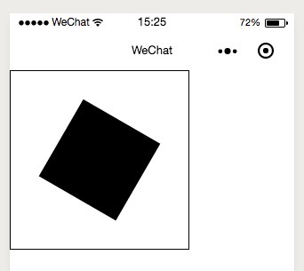
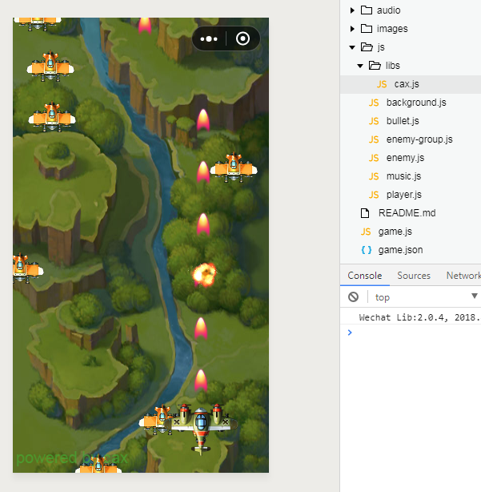

简体中文 | [English](./README.EN.md) 

# Cax [](https://www.npmjs.com/package/cax) 

> 小程序、小游戏以及 Web 通用 Canvas 渲染引擎

* Web DEMO
  * [Simple DEMO](https://dntzhang.github.io/cax) 
  * [Animation DEMO](https://dntzhang.github.io/cax/packages/cax/examples/to/) 
  * [Clip DEMO](https://dntzhang.github.io/cax/packages/cax/examples/clip/) 
  * [Clip Transform DEMO](https://dntzhang.github.io/cax/packages/cax/examples/clip-transform/) 
* 小程序 DEMO 正在审核中敬请期待
* 小游戏 DEMO 正在审核中敬请期待

## 特性

* Learn Once, Write Anywhere(小程序、小游戏、PC Web、Mobile Web)
* 支持小程序、小游戏以及 Web 浏览器渲染
* 小程序、小游戏和 Web 拥有相同简洁轻巧的 API
* 高性能的渲染架构
* 超轻量级的代码体积
* 松耦合的渲染架构
* 支持 Canvas 元素管理
* 支持 Canvas 元素事件体系
* 图灵完备的 group 嵌套体系
* 内置 tween 和 to 的运动能力
* 内置文本、位图、序列帧、绘图对象和多种矢量绘制对象

---

- [一分钟入门小程序 cax 使用](#一分钟入门小程序-cax-使用)
- [一分钟入门小游戏 cax 使用](#一分钟入门小游戏-cax-使用)
- [一分钟入门 Web cax 使用](#一分钟入门-web-cax-使用)
- [内置对象](#内置对象)
  - [Group](#group)
  - [Bitmap](#bitmap)
  - [Sprite](#sprite)
  - [Text](#text)
  - [Graphics](#graphics)
  - [Shape](#shape)
	- [Rect](#rect)
	- [Circel](#circel)
	- [Ellipse](#ellipse)
  - [Element](#element)
	- [Button](#button)
- [属性](#属性)
  - [Transform](#transform)
  - [Alpha](#alpha)
  - [CompositeOperation](#compositeoperation)
  - [Cursor](#cursor)
- [事件](#事件)
	- [小程序事件](#小程序事件) 
  - [Web 事件](#web-事件) 
- [运动](#运动)
- [裁剪](#裁剪)
- [自定义对象](#自定义对象)
	- [自定义 Shape](#自定义-shape) 
  - [自定义 Element](#自定义-element) 
- [谁在使用？](#谁在使用)
- [License](#license)


## 一分钟入门小程序 cax 使用

到 GitHub [下载 cax 自定义组件](https://github.com/dntzhang/cax/tree/master/packages/cax-weapp)，然后小程序引入 cax 自定义组件:

```
└── cax
    ├── cax.js
    ├── cax.json  
    ├── cax.wxml  
    ├── cax.wxss
    └── index.js
```

在 page 或者 component 里声明依赖:

```json
{
  "usingComponents": {
    "cax":"../cax/cax"
  }
}
```

在的 wxml 里引入 cax 标签:

```html 
<cax id="myCanvas"></cax>
```

在 js 里渲染逻辑:

```js
import cax from '../cax/index'

Page({
  onLoad: function () {
    //比 web 里使用 cax 多传递 this，this 代表 Page 或 Component 的实例
    const stage = new cax.Stage(200, 200, 'myCanvas', this)
    const rect = new cax.Rect(100, 100, {
      fillStyle: 'black'
    })
    
    rect.originX = 50
    rect.originY = 50
    rect.x = 100
    rect.y = 100
    rect.rotation = 30

    rect.on('tap', () => {
      console.log('tap')
    })

    stage.add(rect)
    stage.update()
  }
})
```

效果如下所示:



除了 tap 事件，也可以帮 rect 绑定其他触摸事件：

```js
rect.on('touchstart', () => {
  console.log('touchstart')
})

rect.on('touchmove', () => {
  console.log('touchmove')
})

rect.on('touchend', () => {
  console.log('touchend')
})
```
## 一分钟入门小游戏 cax 使用

到 GitHub [下载 cax 小游戏示例](https://github.com/dntzhang/cax/tree/master/packages/cax-wegame)，目录结构和运行效果如下:



``` js
const stage = new cax.Stage()
```

和小程序以及 Web 不同的是，小游戏创建 Stage 不需要传任何参数。

## 一分钟入门 Web cax 使用

通过 npm 或者 CDN 获取:

``` bash
npm i cax
```

* [https://unpkg.com/cax@latest/dist/cax.min.js](https://unpkg.com/cax@latest/dist/cax.min.js)
* [https://unpkg.com/cax@latest/dist/cax.js](https://unpkg.com/cax@latest/dist/cax.js)


``` js
import cax from 'cax'

const stage = new cax.Stage(200, 200, '#renderTo')
const rect = new cax.Rect(100, 100, {
  fillStyle: 'black'
})

stage.add(rect)
stage.update()
```

除了 Stage 构造函数比小程序第四个参数 `this`，其他使用方式都一样。

## 内置对象

### Group

用于分组， group 也可以嵌套 group，父容器的属性会叠加在子属性上, 比如：

* group 的 x 是 100, group 里的 bitmap 的 x 是 200， 最后 bitmap 渲染到 stage 上的 x 是 300
* group 的 alpha 是 0.7, group 里的 bitmap 的 alpha 是 0.6, 最后 bitmap 渲染到 stage 上的 alpha 是 0.42

```js
const group = new cax.Group()
const rect = new cax.Rect(100, 100 {
  fillStyle: 'black'
})
group.add(rect)
stage.add(group)
stage.update()
```

group 拥有常用的 add 和 remove 方法进行元素的增加和删除。先 add 的会先绘制，所有后 add 的会盖在先 add 的上面。

### Bitmap

```js
const bitmap = new cax.Bitmap(img)
stage.add(bitmap)
stage.update()
```

如果只传 url 而不是 Image 对象的实例，需要这样:

```js
const bitmap = new cax.Bitmap('./wepay.png', ()=>{
  stage.update()
})
stage.add(bitmap)
```

这里需要注意小程序需要配置 downloadFile 需要配置合法域名才能正常加载到图片。

可以设置图片裁剪显示区域，和其他 transform 属性:

```js
bitmap.rect = [0, 0, 170, 140]
bitmap.x = 200
```

### Sprite

序列帧动画组件，可以把任意图片的任意区域组合成一串动画。

```js
const sprite = new cax.Sprite({
    framerate: 7,
    imgs: ['./mario-sheet.png'],
    frames: [
        // x, y, width, height, originX, originY ,imageIndex
        [0, 0, 32, 32],
        [32 * 1, 0, 32, 32],
        [32 * 2, 0, 32, 32],
        [32 * 3, 0, 32, 32],
        [32 * 4, 0, 32, 32],
        [32 * 5, 0, 32, 32],
        [32 * 6, 0, 32, 32],
        [32 * 7, 0, 32, 32],
        [32 * 8, 0, 32, 32],
        [32 * 9, 0, 32, 32],
        [32 * 10, 0, 32, 32],
        [32 * 11, 0, 32, 32],
        [32 * 12, 0, 32, 32],
        [32 * 13, 0, 32, 32],
        [32 * 14, 0, 32, 32]
    ],
    animations: {
        walk: {
            frames: [0, 1]
        },
        happy: {
            frames: [5, 6, 7, 8, 9]
        },
        win: {
            frames: [12]
        }
    },
    playOnce: false,
    currentAnimation: "walk",
    animationEnd: function () {

    }
});
```

### Text

文本对象

``` js
const text = new cax.Text('Hello World', {
  font: '20px Arial',
  color: '#ff7700',
  baseline: 'top'
})
```

### Graphics

绘图对象，用于使用基本的连缀方式的 Canvas 指令绘制图形。

``` js
const graphics = new cax.Graphics()
graphics
    .beginPath()
    .arc(0, 0, 10, 0, Math.PI * 2)
    .closePath()
    .fillStyle('#f4862c')
    .fill()
    .strokeStyle('black')
    .stroke()

graphics.x = 100
graphics.y = 200

stage.add(graphics)
```

### Shape

与 Graphics 不同的是， Shape 一般拥有有限的宽高，所以可以使用离屏 Canvas 进行缓存。下面这些属于 Shape。

#### Rect

``` js
const rect = new cax.Rect(200, 100, {
  fillStyle: 'black'
})
```

#### Circel

``` js
const circel = new cax.Circel(10)
```

#### Ellipse

``` js
const ellipse = new cax.Ellipse(120, 20)
```

注意：从技术上小游戏和 Web 可以离屏 Canvas，小程序不行，因为小程序不支持动态创建离屏 Canvas。

### Element

Element 是多种元素的组合，如 Bitmap、Group、 Text、 Shape 等混合起来的图像。

#### Button

``` js
const button = new cax.Button({
  width: 100,
  height: 40,
  text: "Click Me!"
})
```

## 属性

### Transform

|属性名      |描述   |
|---|---|
| x | 水平偏移 |
| y | 竖直偏移 |
| scaleX | 水平缩放 |
| scaleY | 竖直缩放 |
| rotation | 旋转 |
| skewX | 歪斜 X |
| skewY | 歪斜 Y |
| originX | 旋转基点 X |
| originY | 旋转基点 Y |

### Alpha

|属性名      |描述   |
|---|---|
| alpha | 元素的透明度 |

注意这里父子都设置了 alpha 会进行乘法叠加。

### compositeOperation 

|属性名      |描述   |
|---|---|
| compositeOperation | 源图像绘制到目标图像上的叠加模式 |

注意这里如果自身没有定义 compositeOperation 会进行向上查找，找到最近的定义了 compositeOperation 的父容器作为自己的 compositeOperation。

### Cursor

|属性名      |描述   |
|---|---|
| cursor | 鼠标移上去的形状 |


## 事件

### 小程序事件

|事件名      |描述   |
|---|---|
| tap | 手指触摸后马上离开 |
| touchstart | 手指触摸动作开始 |
| touchmove | 手指触摸后移动 |
| touchend | 手指触摸动作结束 |
| drag | 拖拽 |

### Web 事件

|事件名      |描述   |
|---|---|
| click | 元素上发生点击时触发 |
| mousedown | 当元素上按下鼠标按钮时触发 |
| mousemove | 当鼠标指针移动到元素上时触发 |
| mouseup | 当在元素上释放鼠标按钮时触发 |
| mouseover | 当鼠标指针移动到元素上时触发 |
| mouseout | 当鼠标指针移出元素时触发 |
| tap | 手指触摸后马上离开 |
| touchstart | 手指触摸动作开始 |
| touchmove | 手指触摸后移动 |
| touchend | 手指触摸动作结束 |
| drag | 拖拽 |

## 运动

cax 内置了 to 的能力以连缀的方式写运动效果：

``` js
cax.To.get(bitmap)
    .to()
    .y(340, 2000, cax.easing.elasticInOut)
    .rotation(240, 2000, cax.easing.elasticInOut)
    .begin(() => {
        console.log("Task one has began!")
    })
    .progress(() => {
        console.log("Task one is progressing!")
    })
    .end(() => {
        console.log("Task one has completed!")
    })
    .wait(500)
    .to()
    .rotation(0, 1400, cax.easing.elasticInOut)
    .begin(() => {
        console.log("Task two has began!")
    })
    .progress(() => {
        console.log("Task two is progressing!")
    })
    .end(() => {
        console.log("Task two has completed!")
    })
    .wait(500)
    .to()
    .scaleX(1, 1400, cax.easing.elasticInOut)
    .scaleY(1, 1400, cax.easing.elasticInOut)
    .begin(() => {
        console.log("Task three has began!")
    })
    .progress(() => {
        console.log("Task three is progressing!")
    })
    .end(() => {
        console.log("Task three has completed!")
    })
    .wait(500)
    .to({ x: 300, y: 200 }, 1000, cax.easing.elasticInOut)
    .rotation(360, 1000, cax.easing.elasticInOut)
    .begin(() => {
        console.log("Task four has began!")
    })
    .progress(() => {
        console.log("Task four is progressing!")
    })
    .end(() => {
        console.log("Task four has completed!")
    })
    .start();
```

* `to` 和 `to` 之间的是并行
* `to` 和 `wait` 之前的是并行
* `to` 和 `to` 之间的 与 下一个 `to` 和 `to` 之间的是串行

有点绕，但是很直观，慢慢体会。

当然，也可以通过 set 方法支持任意属性的运动，如:

``` js
.set('y', 240, 2000, cax.easing.elasticInOut)
``` 

等同于

``` js
.y(240, 2000, cax.easing.elasticInOut)
```

[运动演示地址](http://dntzhang.github.io/cax/packages/cax/examples/to/)

## 裁剪

```js
const stage = new cax.Stage(600, 400, 'body')
const bitmap = new cax.Bitmap('./wepay-diy.jpg', () => {
    stage.update()
})
const clipPath = new cax.Graphics()
clipPath.arc(40, 40, 25, 0, Math.PI * 2)
bitmap.clip(clipPath)
stage.add(bitmap)
```

使用下面的代码可以得到同样的效果:

```js
const clipPath = new cax.Graphics()
clipPath.x = 40
clipPath.y = 40
clipPath.arc(0, 0, 25, 0, Math.PI * 2)
```

所以，裁剪区域也是支持所有 transform 属性(x,y,scaleX,scaleY,rotation,skewX,skewY,originX,originY)。

[裁剪演示地址](http://dntzhang.github.io/cax/packages/cax/examples/clip/)

## 自定义对象

### 自定义 Shape

自定义 Shape 继承自 cax.Shape:

``` js
class Sector extends cax.Shape {
  constructor (r, from, to, option) {
    super()

    this.option = option || {}
    this.r = r
    this.from = from
    this.to = to
  }

  draw () {
    this.beginPath()
      .moveTo(0, 0)
      .arc(0, 0, this.r, this.from, this.to)
      .closePath()
      .fillStyle(this.option.fillStyle)
      .fill()
      .strokeStyle(this.option.strokeStyle)
      .lineWidth(this.option.lineWidth)
      .stroke()
  }
}
```

使用 Shape:

``` js
const sector = new Sector(10, 0, Math.PI/6, {
  fillStyle: 'red'
  lineWidth: 2
})
stage.add(sector)
stage.update()
```

### 自定义 Element

自定义 Element 继承自 cax.Group:

``` js
class Button extends cax.Group {
  constructor (option) {
    super()
    this.width = option.width
    this.roundedRect = new  cax.RoundedRect(option.width, option.height, option.r)
    this.text = new cax.Text(option.text, {
      font: option.font,
      color: option.color
    })

    this.text.x = option.width / 2 - this.text.getWidth() / 2 * this.text.scaleX
    this.text.y = option.height / 2 - 10 + 5 * this.text.scaleY
    this.add(this.roundedRect, this.text)
  }
}

export default Button
```

使用:

``` js
const button = new cax.Button({
  width: 100,
  height: 40,
  text: "Click Me!"
})
```

一般情况下，稍微复杂组合体都建议使用继承自 Group，这样利于扩展也方便管理自身内部的元件。
可以看到小游戏的 DEMO 里的 [Player、Bullet、Enemy、Background](https://github.com/dntzhang/cax/tree/master/packages/cax-wegame/js) 全都是继承自 Group。

## 谁在使用？

  

## License

MIT
